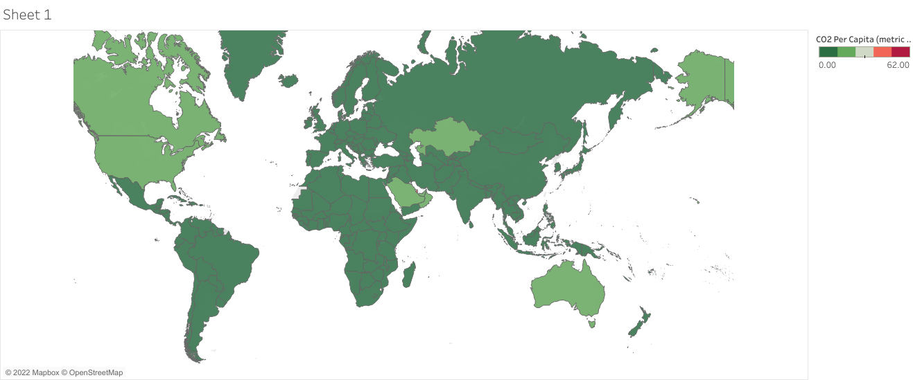
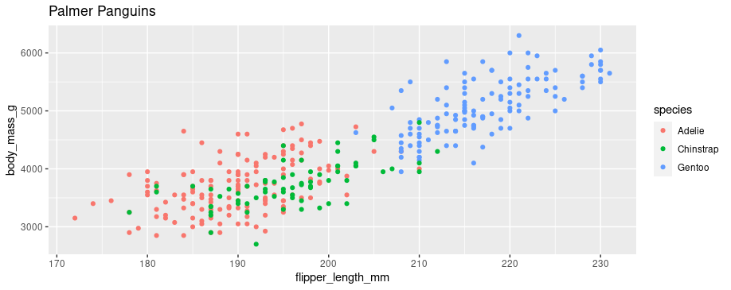

## Project 1 : Dataset link in Tablue

* It was a great lesson for data visualization.
* Tablue is a kind of cool tool for data visualization.
* We can make a presentation of data visualization by using Tablue.
* Tablue helps to make a boared presentation into an interactive presentation.

## Overview of CO2 per capita from Tablue 

## Project 2 : Plamer Penguins

* This project I did on my Data Analysis training.
* I've worked on data cleaning using Microsoft Excel, programming language R.
* I know how to filter data using Microsoft Excel, programming language R.
* I've learnt how to make visualization using Microsoft Excel, programming language R.
* Tablue is a very good tool for data visualization.

## Overview of Penguin's data with labels 

